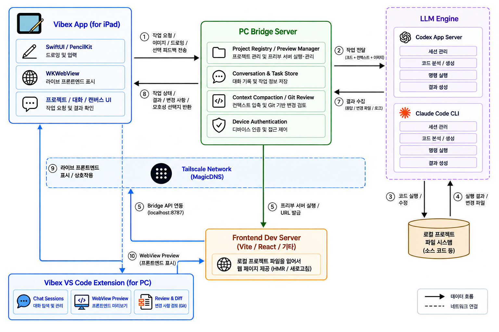
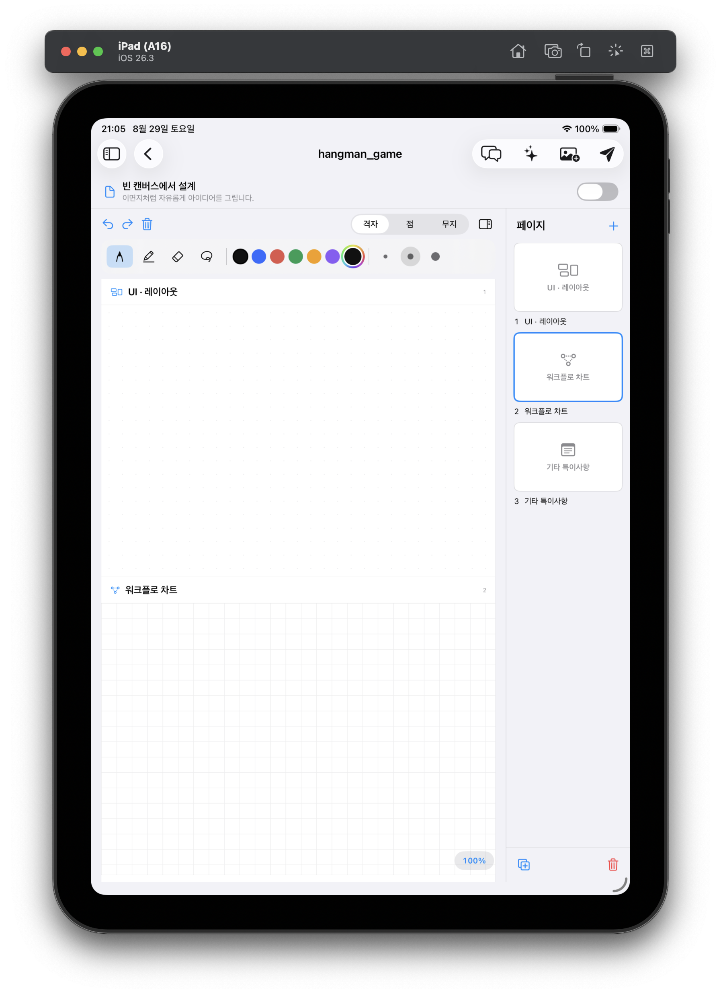
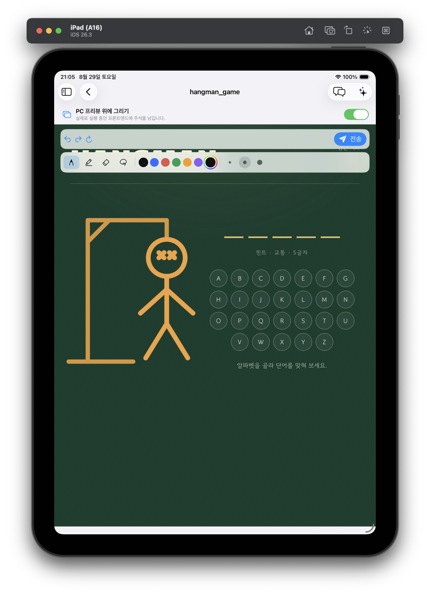

# Vibex: 멀티디바이스 바이브코딩 플랫폼
스마트폰, 태블릿, PC 각각에 최적화된 인터페이스와 자연스러운
바이브코딩 환경 전환을 돕습니다. 언제 어디서든 기기에 구애받지
않고 아이디어를 곧바로 실현시키는 바이브코딩 플랫폼입니다.

## 개발 목적
LLM과 에이전트를 활용한 바이브코딩은 누구나 빠르게 아이디어를 구현하고 코딩할 수 있게 만들어주었습니다. 
하지만 이런 코딩 경험은 여전히 책상 위의 PC에 묶여 있습니다. 대부분의 시간을 보내는 출퇴근길, 근무 중에도 아이디어는 계속 떠오르지만, 개발은 정체됩니다.
설령 원격 접속을 하여도 태블릿의 작은 화면에서 불편한 키보드 입력을 반복하는 일은 번거롭고 개발의 몰입을 끊길 수 있습니다.

따라서 가장 직관적인 인터페이스로 자연스러운 바이브코딩 생태계를 구축하고자 하였습니다.

## 아이디어
스마트폰과 태블릿에서도 터치와 터치펜처럼 각 기기에 이미 최적화된 방식으로 PC의 에이전트와 소통하며, 언제 어디서나 작업을 맡길 수 있습니다. 
더 이상 불편한 조작으로 개발을 이어나갈 필요가 없습니다. 회의실에서 남긴 메모가 개발 지시가 되고, 출근길의 터치 몇 번이 작업 방향을 바꿉니다. 
더 이상 시공간의 구애를 받지 않고, 일상에서 아이디어가 떠오르는 순간이 곧 작업이 시작되는 순간이 됩니다.

## 시스템 구성

* Codex와 Claude Code뿐만 아니라 타 LLM도 추가하는 기능을 제공할 예정입니다.
* 현재는 iPad만 지원하지만 향후 Android 기반 태블릿에도 적용 가능하도록 확장할 계획입니다.

## Vibex 앱

### 1. VS Code 확장 프로그램
PC의 VS Code 패널에서 같은 대화를 유지한 채 턴별 Codex/Claude 선택, 텍스트 작업 전송, 진행
상태 확인, 리뷰 및 작업 취소를 수행할 수 있습니다.

### 2. iPad 앱
<p align="center">
  
  
</p>

- 새 프로젝트 생성 · 기존 프로젝트 접속
- 드로잉코딩 - 텍스트 입력 없이 캔버스에서 그린 MVP나 프론트엔드 프리뷰에서 그린 수정사항이 실시간으로 반영
- 멀티에이전트 - 여러 LLM을 전환해가며 사용

## 기술 구성

| 영역 | 기술 |
|---|---|
| iPad | SwiftUI, PencilKit, UIKit gesture recognizers, WKWebView, iPadOS 16+ |
| PC Bridge | Python 3.12+, FastAPI, Pydantic, Uvicorn |
| 로컬 에이전트 | Codex App Server/CLI, Claude Code CLI |
| VS Code | TypeScript/JavaScript, VS Code Chat Sessions API, WebView |
| 원격 연결 | Tailscale Serve, MagicDNS |
| 상태·복구 | JSON 기반 공용 대화 저장소, Git diff/snapshot |

## 빠른 실행
먼저 Mac에 아래 앱이 설치되어 있어야 합니다.
- Xcode(iPad 앱 빌드용)
- VS Code 1.115 이상
- Codex 또는 Claude Code 중 하나 이상
  ```bash
  codex --version
  claude --version
  ```
- Python 3.12 이상, Node.js 20 이상, Git
- Tailscale(실물 iPad를 Mac과 연결할 때 양측 기기 모두 설치 필요)

### 1. 기본 설정
다른 위치에 clone했다면 첫 줄의 경로만 수정하면 됩니다.
```bash
git clone --recurse-submodules https://github.com/Ralastessh/Vibex.git
cd Vibex
python3 -m venv backend/.venv
backend/.venv/bin/pip install -r requirements.txt
```
```bash
mkdir -p test-projects
printf 'BRIDGE_WORKSPACE_ROOT=%s/test-projects\n' "$(pwd -P)" > backend/.env
grep '^BRIDGE_WORKSPACE_ROOT=' backend/.env
```
Vibex는 이 폴더 아래의 Git 저장소를 프로젝트로 찾습니다.
```bash
# example project
test-projects/hangman_game
```

### 2. 대상 프로젝트 의존성 설치

```bash
cd test-projects/hangman_game
npm install
git status --short
cd ../..
```

### 3. PC용 앱 (VS Code 확장프로그램) 설치

```bash
code /Users/kimjoonsu/Desktop/Vibex
```
VS Code에서 아래를 실행합니다.

1. `Extensions: Install from VSIX...`
2. `vibex-extension/vibex-0.4.15.vsix` 선택
3. `Developer: Reload Window`
4. Chat 또는 우측 Secondary Sidebar에서 `Vibex` 열기
5. 프로젝트 목록에 `hangman_game`이 보이는지 확인

확장이 backend 위치를 못 찾으면 명령 팔레트에서 `Vibex: 백엔드 폴더 설정`을 실행하고 아래 경로를 입력합니다.

```text
/Users/kimjoonsu/Desktop/Vibex/backend
```

### 4. iPad용 앱 설치

#### A. Simulator로 실행
`http://127.0.0.1:8787`을 사용합니다.

```bash
cd ipad-app
xcodegen generate
open Vibex.xcodeproj
```

Xcode에서 `Vibex` scheme과 iPad Simulator를 선택한 뒤 `Command+R`을 누릅니다. 앱이 뜨면 톱니바퀴 연결 설정에서 `이 Mac에 연결됨` 또는 프로젝트 개수를 확인하고, `hangman_game` 프로젝트를 선택합니다.

#### B. 실제 iPad로 실행
Tailscale MagicDNS 경로를 사용합니다.

1. Mac과 iPad 모두 Tailscale에 같은 계정으로 로그인합니다.
2. VS Code에서 `Vibex: iPad용 Tailscale 게시`를 실행합니다.
3. Xcode에서 실제 iPad를 선택하고 `Command+R`로 앱을 설치합니다.
4. iPad 앱의 톱니바퀴에서 `온라인 목록 새로고침`을 누릅니다.
5. Mac 이름을 선택하고 `연결됨 · 프로젝트 N개`가 뜨는지 확인합니다.

목록에 안 뜨면 `PC 직접 추가`에 Tailscale 기기 이름을 입력합니다. 포트는 앱이 8787을 붙입니다.

### 5. 요청 보내기

1. iPad에서 `hangman_game` 프로젝트를 엽니다.
2. 새 대화를 만듭니다.
3. 프리뷰 토글을 켜서 게임 화면을 띄웁니다.
4. Apple Pencil로 바꾸고 싶은 영역을 표시하고 전송합니다.
5. 이와 동시에 Mac Vibex에서 해당 대화창에서 이미지와 질문, 답변, 변경 파일 등이 보이는지 확인합니다.

### 빠른 문제 해결

| 증상 | 원인과 조치 |
|---|---|
| `Address already in use` | 확장이 이미 8787 Bridge를 실행 중입니다. 새 서버를 띄우지 말고 기존 서버를 사용하거나 기존 프로세스를 종료합니다. |
| `/`에서 `404 Not Found` | 정상입니다. `/api/v1/health`로 확인합니다. |
| 프로젝트가 0개 | `backend/.env`의 절대 작업 루트, 프로젝트의 `.git`, Bridge 재시작 여부를 확인합니다. |
| `vite: command not found` | 해당 프로젝트 폴더에서 `npm install` 후 프리뷰를 다시 시작합니다. |
| 프론트엔드가 없다는 오류 | 프로젝트 또는 하위 폴더에 `package.json`의 `dev/start` 스크립트나 `index.html`이 있는지 확인합니다. |
| 실제 iPad만 연결 실패 | 양쪽 Tailscale 로그인, `Vibex: iPad용 Tailscale 게시`, MagicDNS PC 선택을 확인합니다. |
| VS Code에서 에이전트가 안 보임 | 해당 CLI 설치·로그인과 `codex --version`/`claude --version`을 확인하고 Bridge를 재시작합니다. |
| 작업이 active writer로 실패 | 같은 네이티브 세션이 다른 VS Code/터미널에서 응답 중입니다. 그 응답이 끝난 뒤 다시 전송합니다. |
| Xcode 변경이 반영되지 않음 | 앱을 중지하고 `xcodegen generate` 후 Clean Build Folder 또는 앱 삭제·재설치를 시도합니다. |